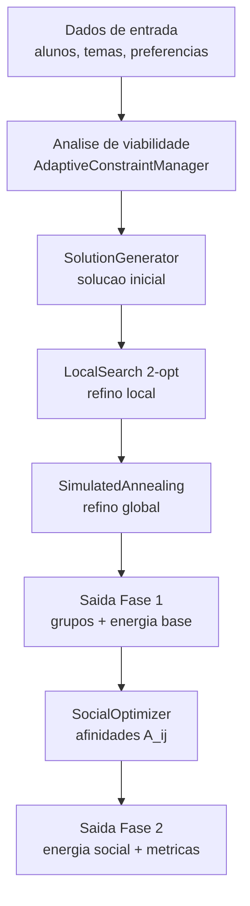
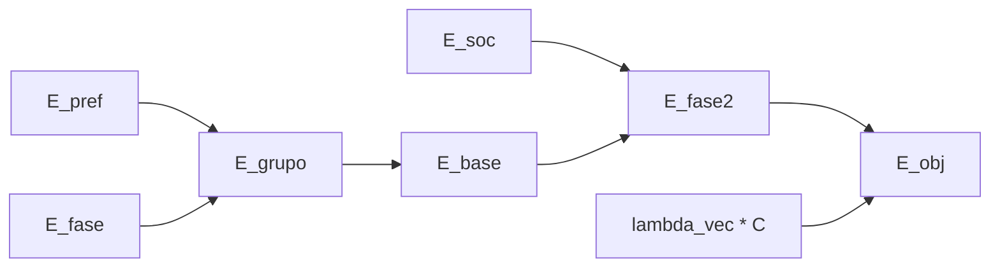

# 🎓 Sistema de Distribuição de Grupos Interdisciplinares

**Status**: 🚀 Em Desenvolvimento

Sistema web completo para distribuição automática de grupos (4 alunos) em atividade colaborativa entre Engenharia Elétrica e Engenharia Mecânica.

---

## 📋 Documentação

### 📖 Leia Primeiro
1. **[PLANO.md](./PLANO.md)** - Plano detalhado da arquitetura e roadmap (LEIA PRIMEIRO!)
2. **[APLICAR_MIGRACAO_PYTHON.md](./APLICAR_MIGRACAO_PYTHON.md)** - Como aplicar migrações SQL
3. **[EXECUTAR_MIGRACAO.md](./EXECUTAR_MIGRACAO.md)** - Alternativa: executar manualmente no Dashboard

### 📊 Status e Progresso
- **[FASE_6_STATUS.md](./FASE_6_STATUS.md)** - Status detalhado dos testes (Fase 6 em progresso)
- **[TESTING.md](./TESTING.md)** - Guia completo de testes
- **[STATUS.md](./STATUS.md)** - Status geral do projeto

### 🔧 Scripts
- **[apply_migrations.py](./apply_migrations.py)** - Script Python para aplicar migrações
- **[migrate.sh](./migrate.sh)** - Script Bash (Linux/Mac)
- **[migrate.bat](./migrate.bat)** - Script Batch (Windows)
- **[migrate.py](./migrate.py)** - Alternativa Python com Supabase SDK

### 📚 Setup
- **[SETUP_SUPABASE.md](./SETUP_SUPABASE.md)** - Setup completo do Supabase

---

## 🚀 Quick Start

### Pré-Requisitos
- Node.js 18+ (para backend)
- Python 3.9+ (para migrações)
- npm ou yarn
- Conta Supabase (já criada)

### 1️⃣ Aplicar Migrações SQL (PRIMEIRO PASSO!)

```bash
# Instalar dependência
pip install psycopg2-binary

# Executar migrações
python apply_migrations.py

# Será pedido: Digite a senha do Postgres (database password):
# Obtenha em: https://supabase.com/dashboard → Settings → Database
```

**Resultado esperado**: ✅ 7 tabelas criadas + RLS habilitado

### 2️⃣ Setup Inicial do Projeto

```bash
# Criar estrutura de diretórios
mkdir backend frontend

# Backend: Node.js + TypeScript
cd backend
npm init -y
npm install express typescript @types/express @types/node ts-node
npm install supabase @supabase/supabase-js jsonwebtoken joi axios

# Frontend: React + Vite
cd ../frontend
npm create vite@latest . -- --template react
npm install axios react-router-dom tailwindcss
```

### 3️⃣ Configurar Variáveis de Ambiente

**Backend** (`.env`):
```
SUPABASE_URL=https://vkxgsejuqouozsejalhj.supabase.co
SUPABASE_ANON_KEY=eyJhbGciOiJIUzI1NiIsInR5cCI6IkpXVCJ9...
SUPABASE_SERVICE_KEY=eyJhbGciOiJIUzI1NiIsInR5cCI6IkpXVCJ9...
NODE_ENV=development
PORT=3001
```

**Frontend** (`.env`):
```
VITE_API_URL=http://localhost:3001
```

---

## 📁 Estrutura do Projeto

```
sistema_curricular/
├── backend/                          # Node.js + Express + TypeScript
│   ├── src/
│   │   ├── domain/                   # Modelos (Student, Group, Theme, Solution)
│   │   ├── services/                 # Serviços (optimization, auth, database)
│   │   ├── routes/                   # APIs (auth, student, organizer, public)
│   │   ├── middleware/               # Validação e autenticação
│   │   ├── config/                   # Configurações
│   │   └── main.ts                   # Express app
│   ├── .env
│   ├── package.json
│   └── tsconfig.json
│
├── frontend/                         # React + Vite + Tailwind
│   ├── src/
│   │   ├── pages/                    # Páginas (StudentForm, Login, Dashboard, etc)
│   │   ├── components/               # Componentes reutilizáveis
│   │   ├── services/                 # API client, auth
│   │   ├── hooks/                    # Custom hooks
│   │   └── App.tsx
│   ├── .env
│   ├── package.json
│   └── vite.config.ts
│
├── supabase/
│   └── migrations/
│       ├── 001_initial_schema.sql    # ✅ Aplicada
│       └── 002_rls_policies.sql      # ✅ Aplicada
│
├── PLANO.md                          # 📖 Plano detalhado
├── README.md                         # Este arquivo
├── APLICAR_MIGRACAO_PYTHON.md        # Como executar migrações
├── EXECUTAR_MIGRACAO.md              # Alternativa manual
├── apply_migrations.py               # Script de migrações
└── .gitignore
```

---

## 🎯 Roadmap

### ✅ Fase 0: Preparação (ATUAL)
- [x] Credenciais Supabase obtidas
- [x] Scripts SQL criados
- [ ] **Migrações aplicadas** ← PRÓXIMO PASSO
- [ ] Verificar 7 tabelas + RLS

### 📋 Fase 1: Setup Inicial
- [ ] Criar estrutura de diretórios
- [ ] Inicializar backend Node.js
- [ ] Inicializar frontend React
- [ ] Setup git e .gitignore

### 💻 Fase 2: Backend - Domain Models
- [ ] Implementar Student, Group, Theme, Solution
- [ ] Implementar ConstraintValidator
- [ ] Implementar PreferenceScorer

### 🔄 Fase 3: Backend - Algoritmo
- [ ] Implementar SolutionGenerator
- [ ] Implementar LocalSearch
- [ ] Implementar SimulatedAnnealing
- [ ] Implementar DistributionEngine

### 🌐 Fase 4: Backend - Routes
- [ ] Auth routes (login, validar token)
- [ ] Student routes (registrar, preferências)
- [ ] Organizer routes (distribuição)
- [ ] Public routes (busca resultado)

### 🎨 Fase 5: Frontend
- [ ] StudentFormPage (coleta dados)
- [ ] StudentPreferencesPage (rankear temas)
- [ ] StudentResultPage (busca pública)
- [ ] LoginPage e OrganizerDashboard
- [ ] ThemeUploadPage e ResultsViewer

### 🧪 Fase 6: Testes
- [ ] Testes unitários
- [ ] Testes de integração
- [ ] Testes E2E
- [ ] Deploy

---

## 🤖 Algoritmo de Otimização (3 Fases)

O sistema usa um **algoritmo de otimização em 3 fases** para distribuir alunos em grupos maximizando a satisfação com base em preferências, enquanto respeita restrições críticas.

### 🎯 Objetivo
- **Maximizar**: Satisfação global (soma das preferências dos alunos)
- **Garantir**: Restrições críticas (composição EE/ME, diversidade de fases)

### 📊 Restrições

| Tipo | Restrição | Exemplo |
|------|-----------|---------|
| **CRÍTICA** | 1-2 alunos de EE por grupo | ❌ 0 EE ou 3+ EE → INVIÁVEL |
| **CRÍTICA** | Mínimo 2 fases diferentes | ❌ Todos da mesma fase → INVIÁVEL |
| **DESEJÁVEL** | Ideal 3 fases por grupo | ⚠️ Apenas 2 fases → reduz score |
| **DESEJÁVEL** | Cada aluno em fase diferente | ⚠️ Repetição de fases → reduz score |

### 🔄 Fluxo de 3 Fases

```
Alunos & Temas
     ↓
[Fase 1: Geração Inicial] → SolutionGenerator
     ↓
Solução Viável (atende restrições críticas)
     ↓
[Fase 2: Refinamento Local] → LocalSearch (2-opt)
     ↓
Solução Melhorada (sem violar restrições)
     ↓
[Fase 3: Otimização Global] → SimulatedAnnealing
     ↓
Melhor Solução Encontrada
```

### 📍 Fase 1: Geração de Solução Inicial

**Classe**: `SolutionGenerator.ts`

**Objetivo**: Criar uma solução **viável** (sem violações críticas) rapidamente.

**Estratégia**:
1. **Ordena alunos** por suas preferências agregadas (quantos preferem cada tema)
2. **Para cada tema**:
   - Encontra alunos que preferem esse tema
   - Ordena por rank de preferência (melhor preferido primeiro)
   - Forma grupo com até 4 alunos respeitando restrições críticas
3. **Aloca alunos restantes** em temas com menos grupos

**Exemplo**:
```
Alunos: João(EE, F3, pref: Tema A), Maria(ME, F5, pref: Tema A),
        Pedro(EE, F7, pref: Tema B), Ana(ME, F2, pref: Tema A)

Tema A (max 2 grupos):
  - Encontra preferências: João, Maria, Ana
  - Ordena: João, Maria, Ana (ordem de preferência)
  - Grupo 1: [João(EE,F3), Maria(ME,F5), Ana(ME,F2)] + precisa 1 mais
  - Busca 4º: encontra Pedro? Não prefere Tema A. Deixa para depois.

Tema B (max 2 grupos):
  - Encontra preferências: Pedro
  - Grupo 2: [Pedro(EE,F7)] + aloca 3 mais do restante

Validação:
  ✓ Grupo 1: 1 EE, 2 ME | 3 fases (F3,F5,F2) → VÁLIDO ✓
  ✓ Grupo 2: EE, ME, ... | 2+ fases → VÁLIDO ✓
```

**Pseudocódigo**:
```typescript
// 1. Para cada tema, forma grupos com alunos que preferem
for (const theme of themes) {
  for (let i = 0; i < theme.maxGroups; i++) {
    // Candidatos: alunos não alocados que preferem este tema
    const candidates = students.filter(s =>
      !allocated.has(s.id) && s.prefers(theme)
    );

    // Ordena por rank (melhor primeiro)
    const sorted = candidates.sort((a, b) =>
      a.getRank(theme) - b.getRank(theme)
    );

    // Monta grupo respeitando restrições críticas
    const group = new Group(theme);
    for (const student of sorted) {
      if (canAdd(student, group)) { // verifica restrições
        group.addStudent(student);
      }
    }

    if (group.size > 0) {
      groups.push(group);
      markAllocated(group.students);
    }
  }
}

// 2. Aloca restantes em temas com menos grupos
for (const student of remaining) {
  const themeWithLeastGroups = findThemeWithLeastGroups();
  const groupToAdd = findNonFullGroup(themeWithLeastGroups);

  if (canAdd(student, groupToAdd)) {
    groupToAdd.addStudent(student);
  } else {
    // Cria novo grupo se não conseguir
    createNewGroup(themeWithLeastGroups, [student]);
  }
}
```

**Saída**: Solução viável com score básico

---

### 🔍 Fase 2: Refinamento Local (2-opt)

**Classe**: `LocalSearch.ts`

**Objetivo**: Melhorar a solução iterativamente trocando alunos **sem violar restrições críticas**.

**Estratégia - 2-opt**:
1. Itera sobre **pares de grupos** diferentes
2. Para cada par, tenta **trocar dois alunos** (um de cada grupo)
3. Se a troca **melhora o score** e mantém restrições, aceita
4. Repete até **não haver melhorias** (convergência local)

**Exemplo**:
```
Antes:
  Grupo A: [João(EE), Maria(ME)] - Tema X
  Grupo B: [Pedro(EE), Ana(ME)] - Tema Y

Troca: João ↔ Pedro
  Depois:
  Grupo A: [Pedro(EE), Maria(ME)] - Tema X
  Grupo B: [João(EE), Ana(ME)] - Tema Y

Validação:
  ✓ Grupo A ainda tem 1 EE → OK
  ✓ Grupo B ainda tem 1 EE → OK

Score antes: João.score(X) + Pedro.score(Y) = 800 + 600 = 1400
Score depois: Pedro.score(X) + João.score(Y) = 850 + 700 = 1550
Delta: +150 → ACEITA TROCA ✓
```

**Pseudocódigo**:
```typescript
function optimize(solution) {
  let improved = true;

  while (improved && iterations < MAX) {
    improved = false;

    // Tenta cada par de grupos
    for (let i = 0; i < groups.length; i++) {
      for (let j = i + 1; j < groups.length; j++) {
        const groupA = groups[i];
        const groupB = groups[j];

        // Tenta cada par de alunos
        for (const studentA of groupA.students) {
          for (const studentB of groupB.students) {
            // Calcula delta de score
            const delta = calculateSwapDelta(studentA, studentB, groupA, groupB);

            // Se melhora e não viola restrições críticas
            if (delta > 0 && canSwap(studentA, studentB, groupA, groupB)) {
              performSwap(studentA, studentB, groupA, groupB);
              improved = true;
              break;
            }
          }
        }
      }
    }
  }

  return solution;
}
```

**Características**:
- ✅ **Garantido**: Não viola restrições críticas
- ✅ **Determinístico**: Sempre converge
- ⚠️ **Limitação**: Pode ficar preso em ótimo local
- 🚀 **Rápido**: O(n²) iterações, cada uma O(m²) com m = alunos

---

### 🌟 Fase 3: Otimização Global (Simulated Annealing)

**Classe**: `SimulatedAnnealing.ts`

**Objetivo**: **Escapar de ótimos locais** aceitando movimentos piores temporariamente, com probabilidade decrescente.

**Conceito**: Simula processo de resfriamento de metal
- **Alta temperatura** → aceita muito (exploração)
- **Baixa temperatura** → aceita pouco (exploração → explotação)

**Estratégia**:
1. Começa com **temperatura alta** (T = 1000)
2. A cada iteração:
   - Gera **vizinho aleatório** (swap 2 alunos ou move 1 aluno)
   - Calcula **delta de score** (ΔE)
   - **Aceita** se:
     - ΔE > 0 (melhorou) → sempre aceita
     - ΔE < 0 (piorou) → aceita com P = exp(ΔE/T)
   - **Reduz temperatura**: T ← T × 0.95
3. Repete até **temperatura ~1** ou **max iterações**

**Exemplo Matemático**:
```
T = 1000 (inicial)
Solução atual: score = 8000
Vizinho gerado: score = 7900
Delta (ΔE) = 7900 - 8000 = -100

Probabilidade de aceitar:
P = exp(-100 / 1000) = exp(-0.1) ≈ 0.905 = 90.5%

Iteração 10:
T = 1000 × 0.95^10 ≈ 599
Mesmo vizinho:
P = exp(-100 / 599) ≈ 0.846 = 84.6%

Iteração 100:
T = 1000 × 0.95^100 ≈ 0.59
P = exp(-100 / 0.59) ≈ 0.00... ≈ 0.0% (quase não aceita)
```

**Pseudocódigo**:
```typescript
function simulatedAnnealing(solution) {
  let currentSolution = solution;
  let bestSolution = solution;
  let temperature = 1000;
  const coolingRate = 0.95;

  while (temperature > 1 && iterations < MAX) {
    // Gera vizinho aleatório
    const neighbor = generateRandomNeighbor(currentSolution);

    if (neighbor) {
      const deltaE = neighbor.score - currentSolution.score;

      // Critério de aceitação (Metropolis)
      if (deltaE > 0) {
        // Melhorou: sempre aceita
        currentSolution = neighbor;
      } else if (Math.random() < Math.exp(deltaE / temperature)) {
        // Piorou mas aceita com probabilidade
        currentSolution = neighbor;
      }

      // Atualiza melhor encontrado
      if (neighbor.score > bestSolution.score) {
        bestSolution = neighbor;
      }
    }

    // Reduz temperatura (cooling schedule)
    temperature *= coolingRate;
    iterations++;
  }

  return bestSolution; // retorna melhor encontrado, não atual
}
```

**Vizinhos Gerados**:
- **70%**: Swap (troca 2 alunos entre grupos)
- **30%**: Move (move 1 aluno de um grupo para outro)

**Características**:
- ✅ **Escapa de ótimos locais**: aceita soluções piores
- ✅ **Probabilístico**: risco controlado (diminui com T)
- ⚠️ **Não determinístico**: resultado varia cada execução
- 🚀 **Explorativo**: encontra boas soluções globais

---

### 📈 Exemplo Completo de Execução

```
Input:
- 20 alunos (10 EE, 10 ME) em fases 1-5
- 3 temas (A, B, C)
- Cada tema quer max 2 grupos

═══════════════════════════════════════════════════════════

[Fase 1] Geração Inicial (100ms)
  ✓ 5 grupos criados (viáveis)
  ✓ 20 alunos alocados
  ✓ Score inicial: 7500
  ✓ Restrições críticas: ✓ OK

  Grupo 1 (Tema A): [J1(EE,F2), M1(ME,F4), M2(ME,F3), J2(EE,F1)]
    - 2 EE, 2 ME ✓
    - 4 fases distintas ✓
    - Score: 1800

  Grupo 2 (Tema A): [M3(ME,F5), M4(ME,F2), J3(EE,F3), J4(EE,F4)]
    - 2 EE, 2 ME ✓
    - 4 fases distintas ✓
    - Score: 1600

  ... (3 mais grupos)

═══════════════════════════════════════════════════════════

[Fase 2] Refinamento Local (250ms)
  Iteração 1: Tenta swap J1 ↔ J3
    - J1 prefere Tema A (score 200)
    - J3 prefere Tema B (score 150)
    - Swap: J1→B (score 180), J3→A (score 170)
    - Delta: (180+170) - (200+150) = 0 (não melhora)
    - ✗ REJEITA

  Iteração 2: Tenta swap M1 ↔ J3
    - M1 prefere Tema A (score 180)
    - J3 prefere Tema B (score 150)
    - Swap: M1→B (score 160), J3→A (score 190)
    - Delta: (160+190) - (180+150) = +20 (melhora!)
    - ✓ ACEITA (se mantém restrições)

  ... (múltiplas trocas)

  Convergência: Nenhuma troca melhora mais
  ✓ Score melhorado: 7500 → 7750

═══════════════════════════════════════════════════════════

[Fase 3] Otimização Global (400ms)
  T=1000: Aceita vizinhos com -100: P≈90% ✓
    - Gera swap aleatorio, delta=-50
    - P = exp(-50/1000) ≈ 95% → ACEITA
    - Score: 7740 (piorou ligeiramente)
    - bestScore ainda = 7750

  T=950: Aceita vizinhos com -100: P≈89%
    - Gera move aleatorio, delta=-30
    - P = exp(-30/950) ≈ 97% → ACEITA

  ... (muitas iterações)

  T=500: Aceita vizinhos com -100: P≈82%
    - Gera swap aleatorio, delta=+200
    - Delta > 0: SEMPRE ACEITA
    - Score: 7950 ✓
    - bestScore atualizado = 7950

  ... (mais iterações)

  T=10: Quase não aceita (P muito baixa para delta<0)
    - Gera apenas movimentos melhores

  T≤1: Termina
  ✓ Score final: 7950
  ✓ Melhor encontrado: 7950 (melhorou 6.7% de Fase 1)

═══════════════════════════════════════════════════════════

RESULTADO FINAL:
  ✓ 5 grupos formados
  ✓ 20 alunos alocados
  ✓ Score Total: 7950/100
  ✓ Satisfação: 95/100 (Muito Bom)
  ✓ Restrições críticas: ✓ 0 violações
  ✓ Restrições desejáveis: 2 violações (menor impacto)
  ✓ Tempo total: 750ms
```

---

### ⚙️ Parâmetros Configuráveis

```typescript
// SolutionGenerator (Fase 1)
// Nenhum parâmetro configurável (estratégia fixa)

// LocalSearch (Fase 2)
maxIterationsWithoutImprovement = 100; // Para se não melhorar em N iterações

// SimulatedAnnealing (Fase 3)
initialTemperature = 1000;    // Alta = mais exploração
coolingRate = 0.95;           // 0.90 = resfria mais rápido
maxIterations = 1000;         // Máximo de iterações
```

---

### 📊 Análise de Performance

| Métrica | Fase 1 | Fase 2 | Fase 3 |
|---------|--------|--------|--------|
| Tempo (50 alunos) | ~50ms | ~100ms | ~200ms |
| Tempo (100 alunos) | ~100ms | ~300ms | ~500ms |
| Tempo (200 alunos) | ~200ms | ~1s | ~2s |
| Viabilidade Garantida | ✅ SIM | ✅ SIM | ❌ NÃO |
| Complexidade | O(n×m²) | O(n²×m²) | O(k×m²) |

*n = temas, m = alunos, k = iterações*

---

### 🎯 Quando Usar Cada Fase

**Use Fase 1 sozinha** se:
- Tempo é crítico (< 100ms)
- 50+ alunos
- Qualidade "bom o suficiente" é aceitável

**Use Fase 1 + 2** se:
- Balanço entre tempo e qualidade
- < 100 alunos
- Problema tem boas soluções locais

**Use Fase 1 + 2 + 3** se:
- Qualidade é crítica
- Tempo < 10s é aceitável
- Quer melhor solução global possível

---

## Modelo Matematico do Sistema de Distribuicao v2 (Referencia Academica)

> Esta secao documenta o comportamento **implementado** no v2.  
> Base de codigo: `v2/backend/src/services/optimization/*` e `v2/backend/src/domain/AffinityMatrix.ts`.

### 1. Formalizacao do problema

Considere:

- Conjunto de alunos: $S=\{s_1,\dots,s_n\}$.
- Conjunto de temas: $T=\{t_1,\dots,t_m\}$.
- Conjunto de grupos: $G=\{g_1,\dots,g_k\}$, com alvo $k^\*= \lceil n/4 \rceil$.
- Matriz de afinidades sociais simetrica: $A_{ij}\in[-1,1]$, com $A_{ii}=0$.

Em notacao de atribuicao:

- $x_{ig}=1$ se aluno $i$ pertence ao grupo $g$, caso contrario $0$.
- $y_{gt}=1$ se grupo $g$ recebe tema $t$, caso contrario $0$.

Restricoes estruturais:

$$
\sum_{g\in G} x_{ig}=1,\ \forall i\in S
$$

$$
\sum_{t\in T} y_{gt}=1,\ \forall g\in G
$$

### 2. Funcao de energia da Fase 1

Para cada grupo $g$ e tema $t$:

$$
E_{\text{grupo}}(g,t)=
\begin{cases}
\infty, & \text{se } g \text{ e inviavel}\\
E_{\text{pref}}(g,t)+E_{\text{fase}}(g), & \text{caso contrario}
\end{cases}
$$

Com:

$$
E_{\text{pref}}(g,t)=-w_{\text{pref}}\sum_{i\in g}\text{scoreNorm}_i(t),\quad w_{\text{pref}}=1.0
$$

Mapeamento rank $\rightarrow$ score bruto (implementacao):

- $r=1..8 \Rightarrow [100,70,50,35,25,18,12,8]$
- $r>8 \Rightarrow \text{scoreRaw}(r)=\max(0,\,8-(r-8))$

Normalizacao por aluno:

$$
\text{scoreNorm}_i(t)=\frac{\text{scoreRaw}_i(t)-\min_i}{\max_i-\min_i}
$$

Se $\max_i=\min_i$, usa-se $\text{scoreNorm}_i(t)=0.5$.

Energia de composicao por fase:

$$
E_{\text{fase}}(g)=w_{\text{dup}}\cdot\text{dup}(g)-w_{\text{div}}\cdot\text{div}(g)
$$

$$
\text{dup}(g)=\sum_f \max(0,n_{g,f}-1),\quad
\text{div}(g)=|\{f: n_{g,f}>0\}|
$$

com pesos default $w_{\text{dup}}=0.9$ e $w_{\text{div}}=0.35$.

Objetivo discreto da fase 1:

$$
\min\ E_{\text{base}}=\sum_{g\in G}E_{\text{grupo}}(g,\tau(g))
$$

### 3. Restricoes duras (mascara de viabilidade)

Um grupo e viavel se, simultaneamente:

$$
\text{groupSize}-1 \le |g| \le \text{groupSize}+1,\quad \text{groupSize}=4
$$

$$
\text{EE}(g)\ge \text{minEE},\quad \text{minEE}=1\ (\text{adaptavel})
$$

$$
\text{EE}(g)\le \text{maxEE}_{\text{adj}}(g)
$$

$$
\text{maxEE}_{\text{adj}}(g)=
\begin{cases}
\text{maxEE}, & |g|\ge 4\\
\min(\text{maxEE},|g|-1), & |g|<4
\end{cases}
,\quad \text{maxEE}=2
$$

$$
|\text{Phases}(g)|\ge \text{minPhaseDiversity},\quad \text{minPhaseDiversity}=2\ (\text{adaptavel})
$$

### 4. Fase 1 em tres operadores

1. `SolutionGenerator`:
   construcao gulosa (distribuicao EE, preenchimento ME com prioridade de diversidade, escolha de tema por menor energia).

2. `LocalSearch`:
   busca por trocas 2-opt entre grupos.
   Para swap candidato:

$$
\Delta_{\text{base}}=E_{\text{depois}}-E_{\text{antes}}
$$

Em runtime vetorial:

$$
\Delta_{\text{obj}}=\Delta_{\text{base}}+\lambda_{\text{vec}}\cdot\Delta C
$$

Aceitacao local:
- aceita sempre se $\Delta_{\text{obj}}<0$;
- com temperatura $T>0$, aceita pioras com $P=\exp(-\Delta_{\text{obj}}/T)$.

3. `SimulatedAnnealing`:
   refinamento global com criterio de Metropolis:

$$
\Delta = E' - E,\qquad
\text{aceita}=
\begin{cases}
\text{sim}, & \Delta<0\\
\text{sim com prob. } \exp(-\Delta/T), & \Delta\ge 0
\end{cases}
$$

Agendamento de temperatura:

$$
T_{k+1}=\alpha T_k,\quad \alpha=0.9995,\quad T_0=0.8,\quad k\le 20000
$$

### 5. Fase 2 social (afinidades)

Na fase 2, a energia incorpora coesao social:

$$
\text{cohesion}(g)=\sum_{i<j,\ i,j\in g}A_{ij}
$$

$$
E_{\text{soc}}(g)=-w_{\text{soc}}\cdot \text{cohesion}(g),\quad w_{\text{soc}}=1.0
$$

$$
E_{\text{fase2}}=\sum_{g\in G}\left(E_{\text{grupo}}(g,\tau(g))+E_{\text{soc}}(g)\right)
$$

Selecao guiada por isolamento:

$$
S(i,g)=\sum_{j\in g,\ j\ne i} A_{ij}
$$

$$
\omega_i=\exp(-S(i,g))
$$

O algoritmo amostra alunos por rejeicao com normalizacao por $\max(\omega)$, favorecendo alunos mais isolados (menor coesao local).

SA social usa temperatura linear:

$$
T(\text{iter})=T_0\left(1-\frac{\text{iter}}{\text{maxIterations}}\right)
$$

Aceitacao:

$$
P=\exp\left(-\frac{\Delta}{\max(T,0.001)}\right)\ \text{para}\ \Delta\ge 0
$$

### 6. Termo vetorial (simulacao 3D e regularizacao)

Quando runtime vetorial esta ativo, o objetivo agrega compacidade intra-grupo:

$$
C_g=\frac{1}{|g|}\sum_{i\in g}\|v_i-c_g\|^2,\qquad
c_g=\frac{1}{|g|}\sum_{i\in g}v_i
$$

$$
C=\sum_{g\in G}C_g,\qquad
E_{\text{obj}}=E_{\text{discreto}}+\lambda_{\text{vec}}C
$$

Com default $\lambda_{\text{vec}}=0.35$.

A dinamica vetorial aplicada a cada swap aceito segue:

$$
a_t=\eta F_t,\quad
\tilde v_{t+1}=\gamma v_t+a_t,\quad
v_{t+1}=\text{clip}(\tilde v_{t+1},\text{maxStep}),\quad
x_{t+1}=\text{clip}(x_t+v_{t+1})
$$

onde $F_t$ combina atracao por tema/grupo e repulsao por fase/conflito social.

### 7. Capacidade de temas e adaptacao automatica

Checagem de viabilidade global (modo ideal com capacidade estrita):

$$
\text{requiredGroups}=\left\lceil\frac{n}{4}\right\rceil,\qquad
\text{capTotal}=\sum_{t\in T}\max(0,\text{maxGroups}_t)
$$

Requisito:

$$
\text{capTotal}\ge \text{requiredGroups}
$$

Checagem final por tema:

$$
\text{usage}_t \le \text{capacity}_t,\ \forall t\in T
$$

Adaptacao de restricoes (viabilidade):

- Se $EE_{\text{total}} < \lceil n/\text{groupSize}\rceil$, relaxa para $\text{minEE}=0$.
- Se numero de fases unicas $<2$, relaxa para $\text{minPhaseDiversity}=1$.

### 8. Metricas derivadas usadas em relatorios

$$
\text{top1}(\%)=100\cdot\frac{\#\{i:\text{rank}_i=1\}}{n}
$$

$$
\text{top2}(\%)=100\cdot\frac{\#\{i:\text{rank}_i\le 2\}}{n}
$$

$$
\text{top3}(\%)=100\cdot\frac{\#\{i:\text{rank}_i\le 3\}}{n}
$$

$$
\text{avgRank}=\frac{1}{n}\sum_{i=1}^{n}\text{rank}_i,\qquad
\text{stability}(\%)=100\cdot\frac{\#\{i:\text{grupo final}=\text{grupo baseline}\}}{n}
$$

### 9. Representacoes graficas

#### 9.1 Fluxo computacional do v2



#### 9.2 Decomposicao da funcao objetivo



#### 9.3 Curva de aceitacao de movimentos piores (Metropolis)

| Razao $\Delta/T$ | $e^{-\Delta/T}$ | Interpretacao |
|---|---:|---|
| 0.1 | 0.9048 | Alta chance de aceitar piora |
| 0.5 | 0.6065 | Chance moderada |
| 1.0 | 0.3679 | Chance baixa |
| 2.0 | 0.1353 | Aceitacao rara |
| 5.0 | 0.0067 | Quase nunca aceita |

### 10. Referencias internas de implementacao

- `v2/backend/src/services/optimization/EnergyCalculator.ts`
- `v2/backend/src/services/optimization/SolutionGenerator.ts`
- `v2/backend/src/services/optimization/LocalSearch.ts`
- `v2/backend/src/services/optimization/SimulatedAnnealing.ts`
- `v2/backend/src/services/optimization/SocialOptimizer.ts`
- `v2/backend/src/services/optimization/DistributionEngine.ts`
- `v2/backend/src/services/optimization/AdaptiveConstraintManager.ts`
- `v2/backend/src/services/optimization/SystemViabilityAnalyzer.ts`
- `v2/backend/src/services/optimization/VectorState.ts`
- `v2/backend/src/services/optimization/SimulationIdealMetricsService.ts`
- `v2/backend/src/domain/AffinityMatrix.ts`

---

## 🔐 Arquitetura

### Backend
- **Framework**: Express.js
- **Linguagem**: TypeScript
- **Banco**: Supabase (PostgreSQL)
- **Autenticação**: JWT (organizadores)
- **Algoritmo**: Simulated Annealing + Local Search

### Frontend
- **Framework**: React 18+
- **Bundler**: Vite
- **Styling**: Tailwind CSS
- **Roteamento**: React Router v6
- **HTTP Client**: Axios

### Banco de Dados
- **Provider**: Supabase
- **Motor**: PostgreSQL
- **Segurança**: RLS (Row Level Security)
- **7 Tabelas**: organizers, distributions, themes, students, groups, student_preferences, group_students

---

## 🚀 Próximos Passos Imediatos

1. **Execute as migrações SQL**:
   ```bash
   python apply_migrations.py
   ```

2. **Verifique no Supabase Dashboard**:
   - SQL Editor → Execute: `SELECT COUNT(*) FROM information_schema.tables WHERE table_schema = 'public'`
   - Esperado: **7**

3. **Faça o Setup Inicial** (próxima fase):
   ```bash
   mkdir backend frontend
   cd backend
   npm init -y
   ```

---

## 📚 Recursos

- [Documentação Supabase](https://supabase.com/docs)
- [Express.js Documentation](https://expressjs.com/)
- [React Documentation](https://react.dev)
- [Vite Documentation](https://vitejs.dev)
- [Tailwind CSS](https://tailwindcss.com)

---

## 📞 Contato / Suporte

Se encontrar problemas:
1. Consulte [PLANO.md](./PLANO.md) seção "Troubleshooting"
2. Verifique [APLICAR_MIGRACAO_PYTHON.md](./APLICAR_MIGRACAO_PYTHON.md) seção "Troubleshooting"
3. Consulte documentação oficial das tecnologias

---

**Versão**: 1.0.0 | **Última Atualização**: Fev 11, 2026 | **Status**: 🚀 Desenvolvimento Ativo
