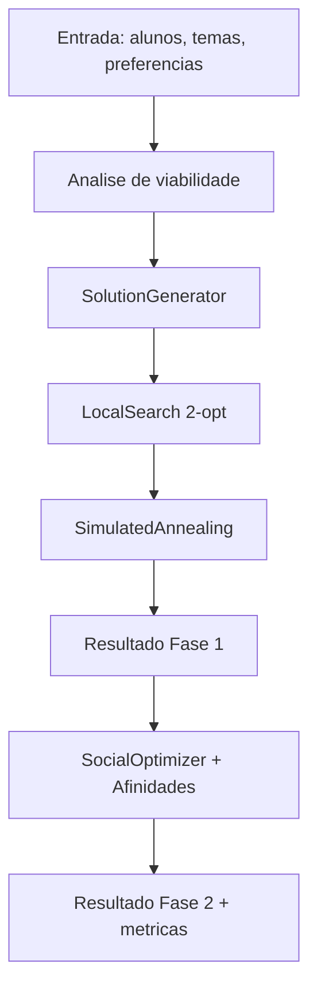
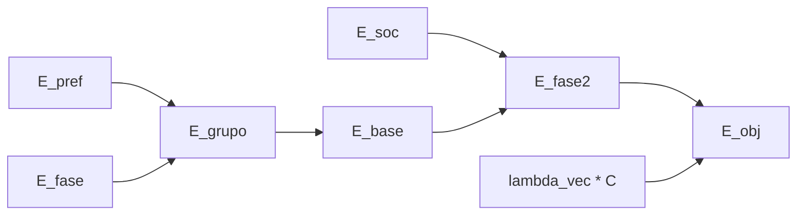

# Sistema de Distribuicao de Grupos Interdisciplinares (v2)

Repositorio de trabalho para distribuicao automatica de alunos em grupos, com:

- restricoes academicas (curso e fase),
- preferencias por tema,
- otimizacao social por afinidade,
- visualizacao/simulacao 3D no fluxo do organizador.

## Estado atual

- Versao ativa para operacao: `v2/backend` + `v2/frontend`.
- Pastas `v1/`, `backend/` e `frontend/` sao legadas.
- Backend v2 exige `SUPABASE_SERVICE_KEY` e `JWT_SECRET` forte.

## Estrutura relevante

```text
.
|-- v2/
|   |-- backend/                 # API Express + TypeScript + Supabase
|   `-- frontend/                # React + Vite
|-- supabase/migrations/         # SQL de schema e ajustes
|-- scripts/setup-env.mjs        # Copia .env.example -> .env
|-- package.json                 # Scripts de orquestracao
`-- README.md
```

## Requisitos

- Node.js 18+
- npm 9+
- Projeto Supabase com chaves validas

## Setup rapido

1. Instale dependencias:

```bash
npm run install:all
```

2. Gere arquivos `.env` a partir dos exemplos:

```bash
npm run setup:env
```

3. Preencha os `.env`:

- `v2/backend/.env`
- `v2/frontend/.env`

### Variaveis obrigatorias (backend v2)

Arquivo: `v2/backend/.env`

```env
SUPABASE_URL=https://<project-ref>.supabase.co
SUPABASE_ANON_KEY=<anon_key>
SUPABASE_SERVICE_KEY=<service_role_key>
JWT_SECRET=<segredo_forte_com_32+_chars>
JWT_ISSUER=curricularizacao-api
JWT_AUDIENCE=student-api
PORT=4300
NODE_ENV=development
CORS_ORIGIN=http://localhost:5174,http://localhost:5173,http://localhost:3000
DEV_SEED_ENABLED=false
```

### Variaveis obrigatorias (frontend v2)

Arquivo: `v2/frontend/.env`

```env
VITE_API_URL=http://localhost:4300
VITE_SUPABASE_URL=https://<project-ref>.supabase.co
VITE_SUPABASE_ANON_KEY=<anon_key>
```

## Execucao

### Rodar v2 completo

```bash
npm run dev:v2
```

### Rodar separado

```bash
npm run dev:v2:backend
npm run dev:v2:frontend
```

### Build, testes e seguranca (v2)

```bash
npm run build:v2
npm run test:v2
npm run security:v2
npm run check:v2
```

## Endpoints principais

Base URL local: `http://localhost:4300`

- `GET /health`
- `POST /api/auth/refresh`
- `POST /api/auth/logout`
- `GET /api/auth/verify`
- `GET /api/themes`
- `GET /api/search/*`
- `POST /api/students/:distributionId`
- `PUT /api/students/me/preferences`
- `GET /api/students/me/current-group`
- `POST /api/organizer/distributions/:distributionId/execute-phase1`
- `POST /api/organizer/distributions/:distributionId/execute-phase2`
- `POST /api/organizer/distributions/:distributionId/simulation/runs/start-phase1`
- `POST /api/organizer/distributions/:distributionId/simulation/runs/start-phase2`
- `GET /api/organizer/simulation/runs/:runId/stream`

## Modelo matematico do sistema de distribuicao v2 (referencia academica)

Esta secao descreve o comportamento implementado em:

- `v2/backend/src/services/optimization/*`
- `v2/backend/src/domain/AffinityMatrix.ts`

### 1) Formalizacao

Sejam:

- alunos: $S=\{s_1,\dots,s_n\}$,
- temas: $T=\{t_1,\dots,t_m\}$,
- grupos: $G=\{g_1,\dots,g_k\}$, com $k \approx \lceil n/4 \rceil$.

Variaveis de atribuicao:

- $x_{ig}=1$ se aluno $i$ esta no grupo $g$; 0 caso contrario,
- $y_{gt}=1$ se grupo $g$ recebe tema $t$; 0 caso contrario.

Restricoes estruturais:

$$
\sum_{g\in G} x_{ig}=1,\ \forall i\in S
$$

$$
\sum_{t\in T} y_{gt}=1,\ \forall g\in G
$$

### 2) Energia de grupo (fase 1)

$$
E_{grupo}(g,t)=
\begin{cases}
\infty, & g\ \text{inviavel}\\
E_{pref}(g,t)+E_{fase}(g), & g\ \text{viavel}
\end{cases}
$$

#### 2.1 Componente de preferencia

$$
E_{pref}(g,t)=-w_{pref}\sum_{i\in g} scoreNorm_i(t)
$$

Com default $w_{pref}=1.0$.

Conversao rank -> score bruto:

- ranks 1..8: `[100, 70, 50, 35, 25, 18, 12, 8]`
- rank > 8: $\max(0, 8-(r-8))$

Normalizacao por aluno:

$$
scoreNorm_i(t)=\frac{scoreRaw_i(t)-min_i}{max_i-min_i}
$$

Se $max_i=min_i$, usa-se $scoreNorm_i(t)=0.5$.

#### 2.2 Componente de fase

$$
E_{fase}(g)=w_{dup}\cdot dup(g)-w_{div}\cdot div(g)
$$

$$
dup(g)=\sum_f \max(0,n_{g,f}-1),\quad div(g)=|\{f: n_{g,f}>0\}|
$$

Defaults: $w_{dup}=0.9$, $w_{div}=0.35$.

Energia global da fase 1:

$$
E_{base}=\sum_{g\in G} E_{grupo}(g,\tau(g))
$$

### 3) Restricoes duras de viabilidade

Um grupo e viavel se:

$$
groupSize-1 \le |g| \le groupSize+1,\quad groupSize=4
$$

$$
EE(g)\ge minEE,\quad EE(g)\le maxEE_{aj}(g)
$$

$$
maxEE_{aj}(g)=
\begin{cases}
maxEE, & |g|\ge groupSize\\
\min(maxEE,|g|-1), & |g|<groupSize
\end{cases}
$$

$$
|\text{fases distintas em }g|\ge minPhaseDiversity
$$

Defaults: `minEE=1`, `maxEE=2`, `minPhaseDiversity=2`.

### 4) Operadores de busca (fase 1)

1. `SolutionGenerator` (construcao inicial gulosa).
2. `LocalSearch` (trocas 2-opt entre grupos).
3. `SimulatedAnnealing` (busca global probabilistica).

Para vizinho candidato:

$$
\Delta=E' - E
$$

No SA:

- aceita sempre se $\Delta<0$,
- se $\Delta\ge0$, aceita com $P=\exp(-\Delta/T)$.

No v2, defaults de SA global:

- $T_0=0.8$
- cooling rate $\alpha=0.9995$
- max iterations = 20000

### 5) Fase 2 social (afinidades)

Matriz simetrica de afinidade: $A_{ij}\in[-1,1]$.

Coesao de grupo:

$$
cohesion(g)=\sum_{i<j,\ i,j\in g} A_{ij}
$$

Energia social:

$$
E_{soc}(g)=-w_{soc}\cdot cohesion(g)
$$

Default: $w_{soc}=1.0$.

Objetivo da fase 2:

$$
E_{fase2}=\sum_{g\in G}\left(E_{grupo}(g,\tau(g))+E_{soc}(g)\right)
$$

Selecao guiada por isolamento:

$$
S(i,g)=\sum_{j\in g,\ j\neq i}A_{ij},\quad \omega_i=\exp(-S(i,g))
$$

Alunos com menor coesao local tendem a ter maior probabilidade de swap.

### 6) Termo vetorial (runtime de simulacao 3D)

Quando runtime vetorial esta ativo:

$$
C_g=\frac{1}{|g|}\sum_{i\in g}\|v_i-c_g\|^2,\quad c_g=\frac{1}{|g|}\sum_{i\in g} v_i
$$

$$
C=\sum_{g\in G}C_g,\quad E_{obj}=E_{discreto}+\lambda_{vec}C
$$

Default: $\lambda_{vec}=0.35$.

### 7) Capacidade de temas

No modo ideal com capacidade ativa:

$$
requiredGroups=\left\lceil \frac{n}{4}\right\rceil,\quad
capTotal=\sum_{t\in T}\max(0,maxGroups_t)
$$

Requisito de viabilidade:

$$
capTotal\ge requiredGroups
$$

E, na solucao final:

$$
usage_t \le capacity_t,\ \forall t\in T
$$

### 8) Adaptacao automatica de restricoes

Se o cenario e matematicamente inviavel:

- se `EE_total < ceil(totalStudents/groupSize)`, relaxa para `minEE=0`,
- se `fases_unicas < 2`, relaxa para `minPhaseDiversity=1`.

### 9) Metricas de saida

$$
top1(\%)=100\cdot\frac{\#(rank=1)}{n}
$$

$$
top2(\%)=100\cdot\frac{\#(rank\le2)}{n}
$$

$$
top3(\%)=100\cdot\frac{\#(rank\le3)}{n}
$$

$$
avgRank=\frac{1}{n}\sum_i rank_i,\quad
stability(\%)=100\cdot\frac{\#(alunos sem troca de grupo)}{n}
$$

## Representacoes graficas

### Fluxo do motor de distribuicao



### Decomposicao da funcao objetivo



## Seguranca implementada no backend v2

- Helmet + CORS com allowlist
- Rate limit global e por escopo
- JWT secret forte obrigatorio
- Service key obrigatoria (sem fallback anon no backend)
- Fluxo de sessao de aluno com refresh token rotativo e CSRF
- Auditoria de eventos de seguranca

## Banco de dados

Migrations SQL em: `supabase/migrations/`

Ajustes recentes incluem hardening de seguranca e flags de execucao por fase.

## Observacao sobre conteudo legado

Pastas legadas continuam no repositorio por historico tecnico. A operacao ativa deve considerar o fluxo v2.
